# SM

## Social Media App Screens – Flutter

This project is a Flutter-based social media application UI demo, showcasing a wide collection of screens and navigation flows that replicate a modern social media experience. The app currently focuses on front-end design, navigation, and screen interactions, with future scope for backend integration and real-time features.

## 📸 Screenshots

  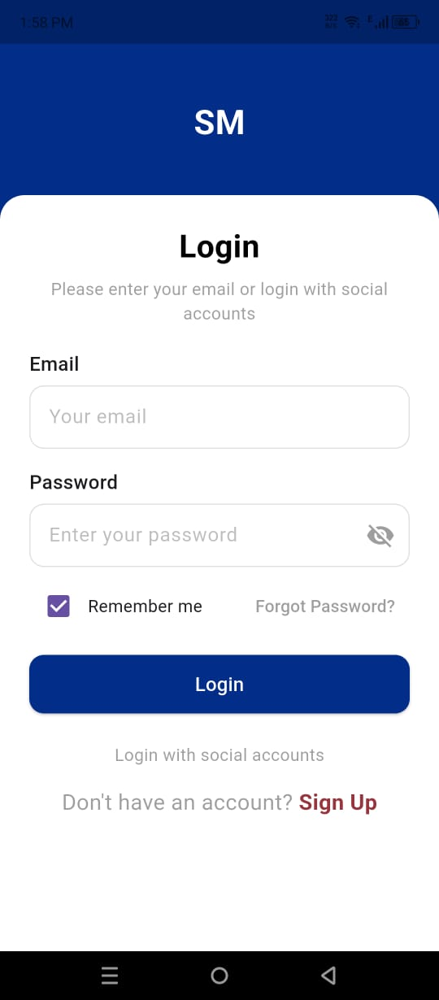
  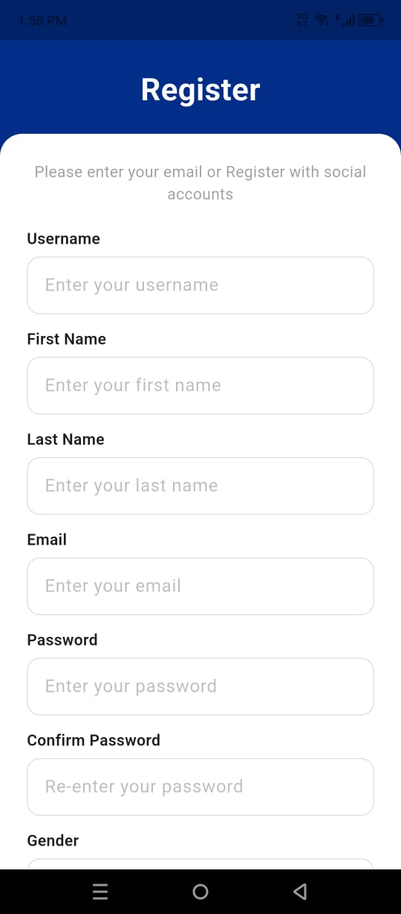
  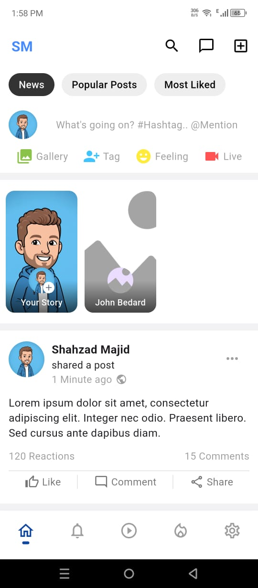
  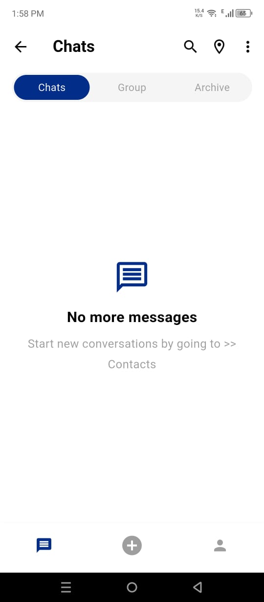
  
  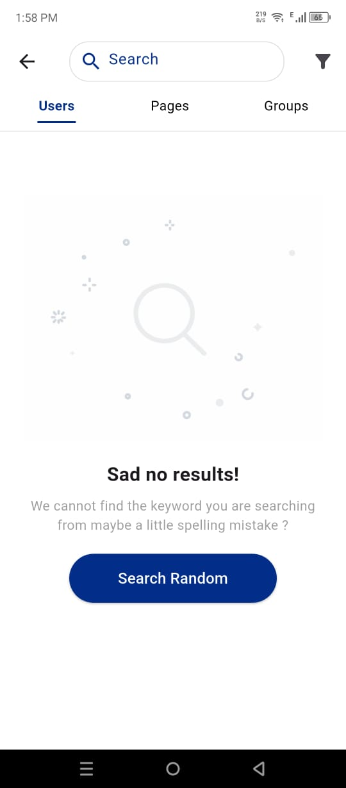
  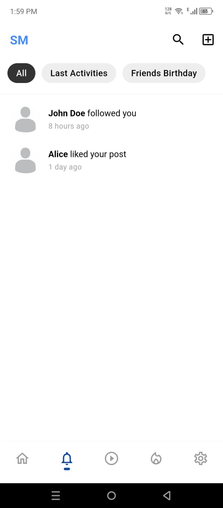
  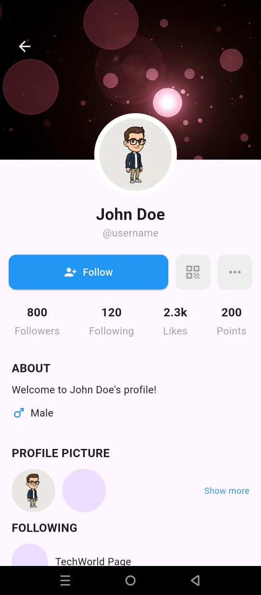
  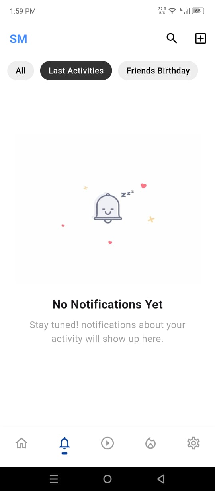
  
  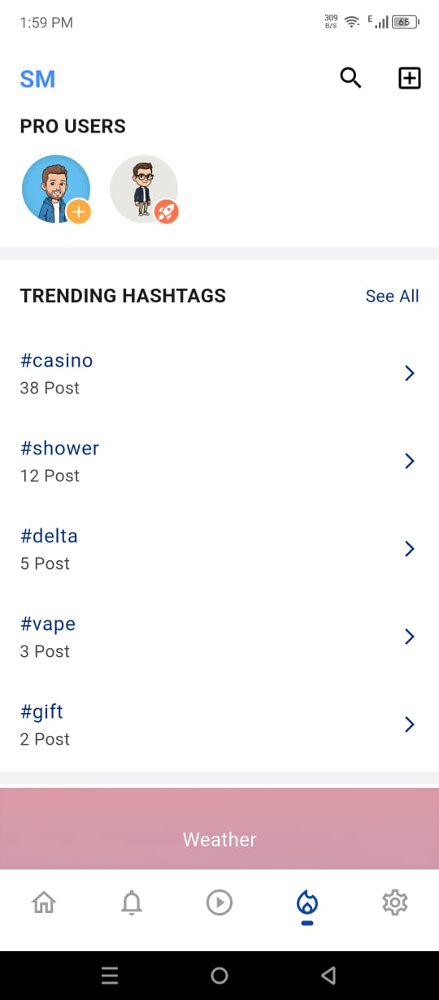
  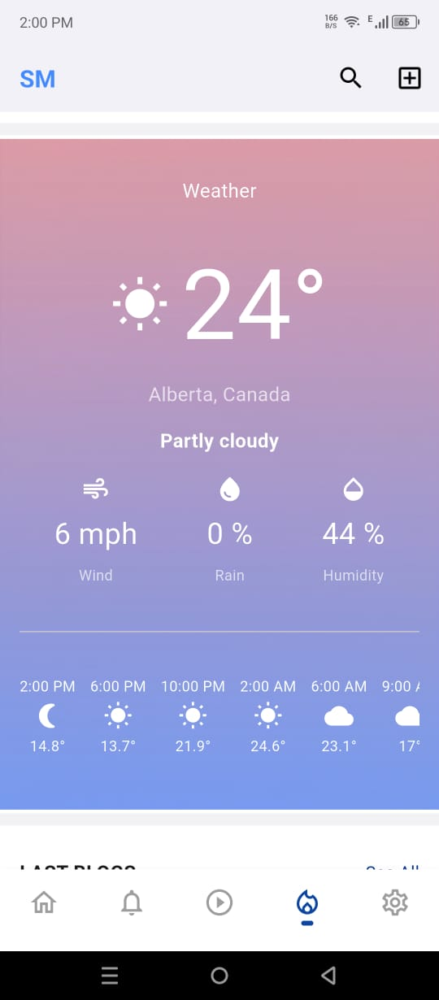
  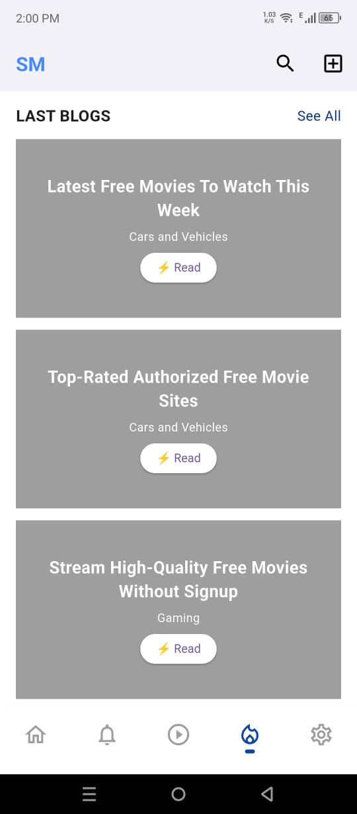
  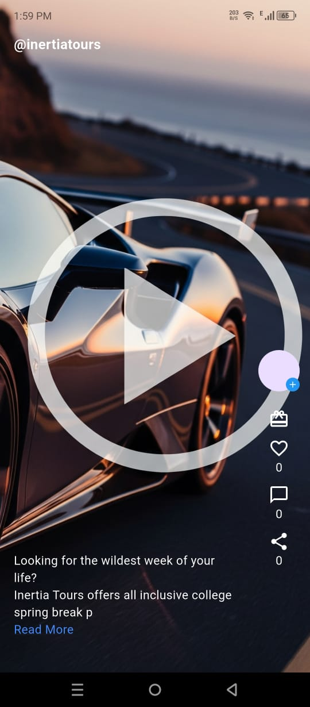
  
  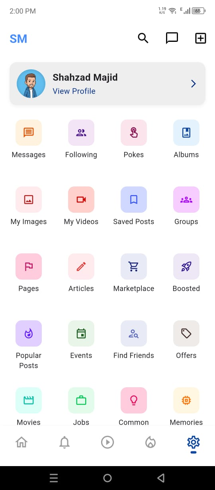
  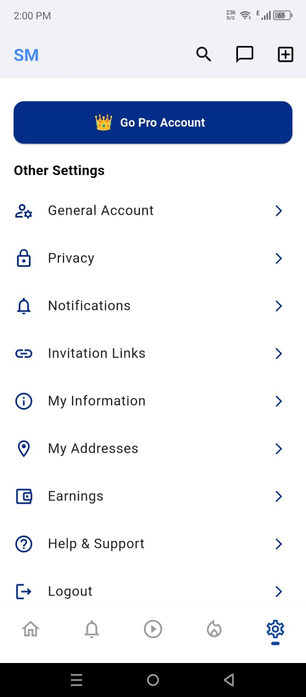
  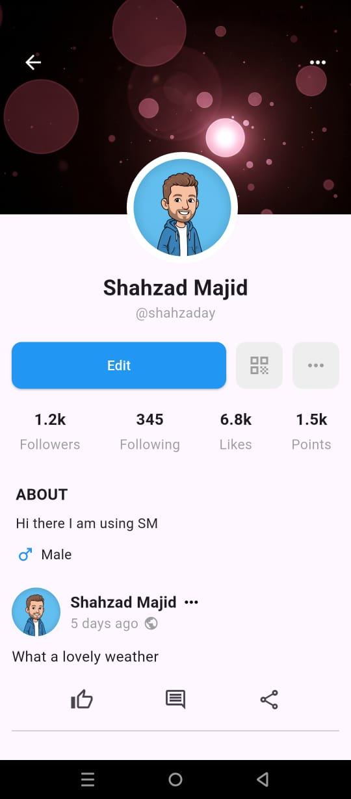
  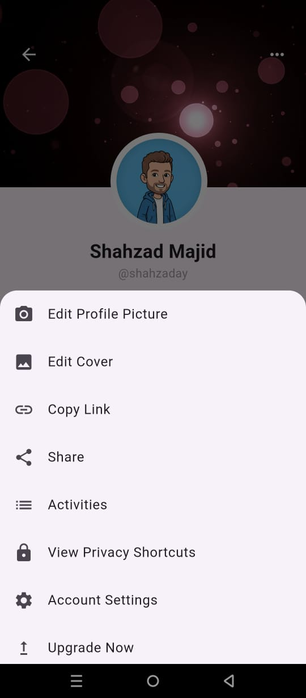

## 🚀 Features Implemented

<ul>
<li><strong>Splash Screen:</strong> Splash screen has a logo.</li>

<li><strong>Login & Signup:</strong> 
<ul>
<li>Improved labels and light grey input fields.</li>
<li>Gender selection via modal popup.</li>
</ul>
</li>

<li><strong>Bottom Navigation Bar:</strong>
<ul>
<li>Home → Home Feed</li>
<li>Notifications → Notification Screen</li>
<li>Reels → Reels Screen</li>
<li>Trending → Trending Screen</li>
<li>Settings → Settings Screen</li>
</ul>
</li>

<li><strong>Home Screen:</strong>
<ul>
<li>Navigation back button removed for a cleaner experience.</li>
<li>Dividers optimized (height increased, extra ones removed).</li>
<li>“What’s Going On” section redesigned with white background and text options (Gallery, Tag, Feeling, Live).</li>
<li>“Your Story” UI updated to match older social media designs.</li>
<li>Screens implemented & linked: Search (with filter popup), Chat (with group, archive, and modal for plus icon actions), Popular Posts, Most Liked, What’s Going On, View User, Comment & React modals.</li>
</ul>
</li>

<li><strong>Notifications:</strong>
<ul>
<li>Tabbed layout with Last Activities and Friends’ Birthdays.</li>
<li>“No Notifications Yet” screen as fallback.</li>
</ul>
</li>

<li><strong>Reels:</strong> 
<ul><li>Linked from bottom navbar, demo image shown.</li></ul>
</li>

<li><strong>Trending:</strong>
<ul>
<li>UI borders highlight Pro users.</li>
<li>Hashtags redirect to Hashtag Detail screen.</li>
<li>Weather and article sections added.</li>
</ul>
</li>

<li><strong>Settings:</strong>
<ul>
<li>My Profile Screen and Options.</li>
<li>Grid Settings: Messages, Following, Pokes, Albums, My Images, My Videos, Saved Posts, Groups, Pages, Articles, Marketplace, Boosted, Popular Posts, Events, Find Friends, Offers, Movies, Jobs, Common Things, Memories, Funding, Games, Live Videos, Advertising.</li>
<li>Go Pro Account screen added.</li>
<li>Other Settings screens: General Account, Privacy, Notifications, Invitation Links, My Information, Earnings, Help & Support.</li>
</ul>
</li>

<li><strong>Profile Options:</strong>
<ul>
<li>Three Dots menu on cover → modal for Edit Cover, Edit Picture, etc.</li>
<li>Three Dots beside username → modal for Save Post, Copy Text, etc.</li>
</ul>
</li>
</ul>

## 🎯 Why This Project?

This project serves as a **learning resource and boilerplate** for anyone interested in Flutter development, offering best practices and a clean code structure.  
With these updates, the app demonstrates a **complete social media front-end workflow** with navigation, popups, modals, and multi-screen UI — ready for backend integration.
